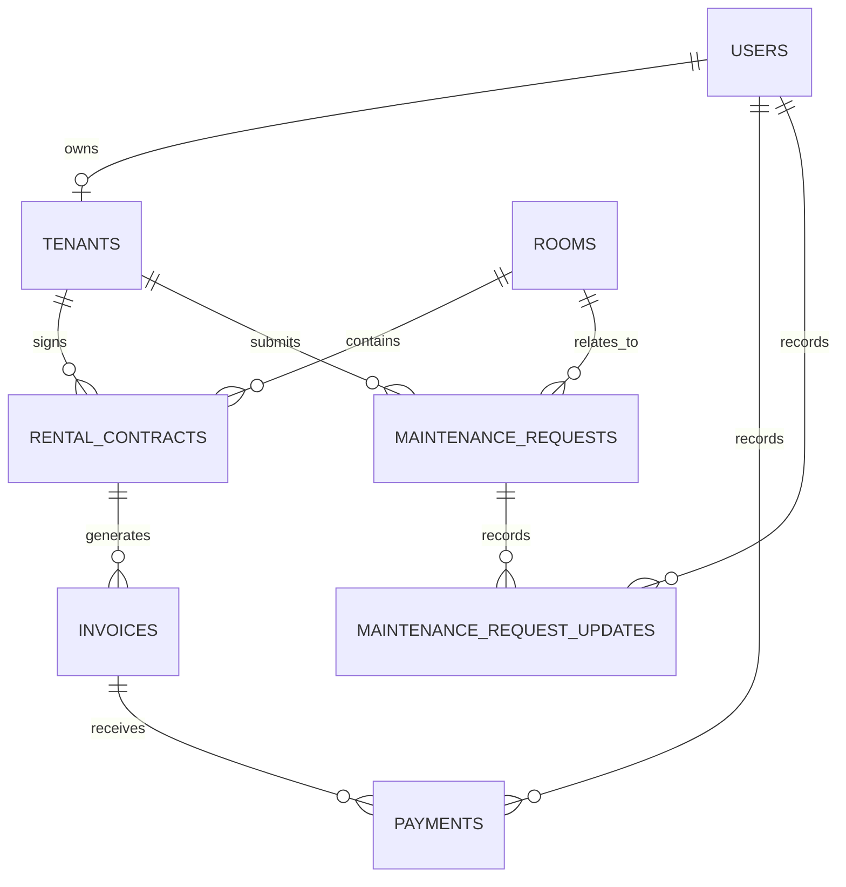

# RMS Database Schema

The initial schema targets Microsoft SQL Server 2022. Domain-generated `Guid`
values are stored as `uniqueidentifier` with `ValueGeneratedNever`. Timestamps
are `datetimeoffset`, contract dates are `date`, money is `decimal(18,2)`, and
meter readings are `decimal(18,3)`.

## Relationship diagram

## Tables

### Users

- PK: `Id`
- Required: `Username` (nvarchar(100)), `PasswordHash` (nvarchar(512)),
  `Role`, `Status`, `FailedLoginAttempts`, `CreatedAt`
- Nullable: `LockedAt`, `UpdatedAt`
- Unique: `UX_Users_Username`
- Check: `CK_Users_FailedLoginAttempts` (`FailedLoginAttempts >= 0`)
- Concurrency: required `RowVersion`

### Tenants

- PK: `Id`
- FK: `UserId -> Users.Id` (`Restrict`)
- Required: `FullName` (nvarchar(200)), `PhoneNumber` (nvarchar(20)),
  `CitizenId` (nvarchar(50)), `CreatedAt`
- Unique: `UX_Tenants_UserId`
- Concurrency: required `RowVersion`
- Phone number and citizen ID are intentionally not unique.

### Rooms

- PK: `Id`
- Required: `RoomNumber` (nvarchar(50)), `MonthlyRent`, `Status`, `CreatedAt`
- Nullable: `Description` (nvarchar(1000)), `UpdatedAt`
- Unique: `UX_Rooms_RoomNumber`
- Check: `CK_Rooms_MonthlyRent` (`MonthlyRent >= 0`)
- Concurrency: required `RowVersion`

### RentalContracts

- PK: `Id`
- FK: `RoomId -> Rooms.Id`, `TenantId -> Tenants.Id` (both `Restrict`)
- Required: `StartDate`, `EndDate`, `MonthlyRent`, `Status`, `CreatedAt`
- Nullable: `ActivatedAt`, `TerminatedAt`, `CancelledAt`, `UpdatedAt`
- Query indexes: `IX_RentalContracts_RoomId`,
  `IX_RentalContracts_TenantId_Status`
- Filtered unique index: `UX_RentalContracts_Room_Active` on `RoomId` where
  `Status = 2` (`ContractStatus.Active`)
- Checks: `CK_RentalContracts_DateRange` (`EndDate > StartDate`) and
  `CK_RentalContracts_MonthlyRent` (`MonthlyRent >= 0`)
- Concurrency: required `RowVersion`

### Invoices

- PK: `Id`
- FK: `ContractId -> RentalContracts.Id` (`Restrict`)
- `BillingPeriod` is converted to required integer `BillingPeriodKey` in
  `YYYYMM` form, for example July 2026 is `202607`.
- Unique: `UX_Invoices_Contract_BillingPeriod` on
  (`ContractId`, `BillingPeriodKey`)
- Checks:
  - `CK_Invoices_BillingPeriod`: year 2000-2100 and month 1-12
  - `CK_Invoices_ElectricityReadings`: end >= start
  - `CK_Invoices_WaterReadings`: end >= start
  - `CK_Invoices_Amounts`: nonnegative amounts and `PaidAmount <= TotalAmount`
- Concurrency: required `RowVersion`

### Payments

- PK: `Id`
- FK: `InvoiceId -> Invoices.Id`,
  `RecordedByUserId -> Users.Id` (both `Restrict`)
- Required: `Amount`, `PaidAt`, `RecordedByUserId`, `CreatedAt`
- Nullable: `Note`
- Check: `CK_Payments_Amount` (`Amount > 0`)
- Index: `IX_Payments_InvoiceId_PaidAt`
- Append-only history; no RowVersion and no standalone repository.

### MaintenanceRequests

- PK: `Id`
- FK: `TenantId -> Tenants.Id`, `RoomId -> Rooms.Id` (both `Restrict`)
- Required: `Title` (nvarchar(200)), `Description` (nvarchar(2000)),
  `Status`, `CreatedAt`
- Nullable: `StartedAt`, `ResolvedAt`, `ClosedAt`, `UpdatedAt`
- Indexes: `IX_MaintenanceRequests_TenantId_Status`,
  `IX_MaintenanceRequests_RoomId_Status`,
  `IX_MaintenanceRequests_Status_CreatedAt`
- Concurrency: required `RowVersion`

### MaintenanceRequestUpdates

- PK: `Id`
- FK: `MaintenanceRequestId -> MaintenanceRequests.Id`,
  `UpdatedByUserId -> Users.Id` (both `Restrict`)
- Required: `PreviousStatus`, `NewStatus`, `UpdatedByUserId`, `OccurredAt`,
  `CreatedAt`
- Nullable: `Note` (nvarchar(2000))
- Index: `IX_MaintenanceRequestUpdates_Request_OccurredAt`
- Append-only history; no RowVersion and no standalone repository.

## Delete behavior

All core foreign keys use `Restrict`. Physical deletion cannot cascade from
users, rooms, contracts, invoices, or maintenance records into business
history. The current product has no physical-delete use case.

| Parent | Child | Foreign key | Delete behavior | Reason |
| --- | --- | --- | --- | --- |
| Users | Tenants | `Tenants.UserId` | Restrict | Preserve account/profile identity |
| Users | Payments | `Payments.RecordedByUserId` | Restrict | Preserve payment audit actor |
| Users | MaintenanceRequestUpdates | `MaintenanceRequestUpdates.UpdatedByUserId` | Restrict | Preserve maintenance audit actor |
| Rooms | RentalContracts | `RentalContracts.RoomId` | Restrict | Preserve rental history |
| Rooms | MaintenanceRequests | `MaintenanceRequests.RoomId` | Restrict | Preserve repair history |
| Tenants | RentalContracts | `RentalContracts.TenantId` | Restrict | Preserve tenant contract history |
| Tenants | MaintenanceRequests | `MaintenanceRequests.TenantId` | Restrict | Preserve submitted requests |
| RentalContracts | Invoices | `Invoices.ContractId` | Restrict | Preserve billing history |
| Invoices | Payments | `Payments.InvoiceId` | Restrict | Preserve payment history |
| MaintenanceRequests | MaintenanceRequestUpdates | `MaintenanceRequestUpdates.MaintenanceRequestId` | Restrict | Preserve request status history |

## BillingPeriod mapping

`Invoice.BillingPeriod` remains a Domain value object and is stored as the
scalar `int` column `BillingPeriodKey`:

- write: `Year * 100 + Month`
- read month: `value % 100`
- read year: `value / 100`
- valid year: 2000-2100
- valid month: 1-12

The check constraint `CK_Invoices_BillingPeriod` validates the range and
`UX_Invoices_Contract_BillingPeriod` enforces one invoice per contract and
period. No separate BillingPeriod table exists.
